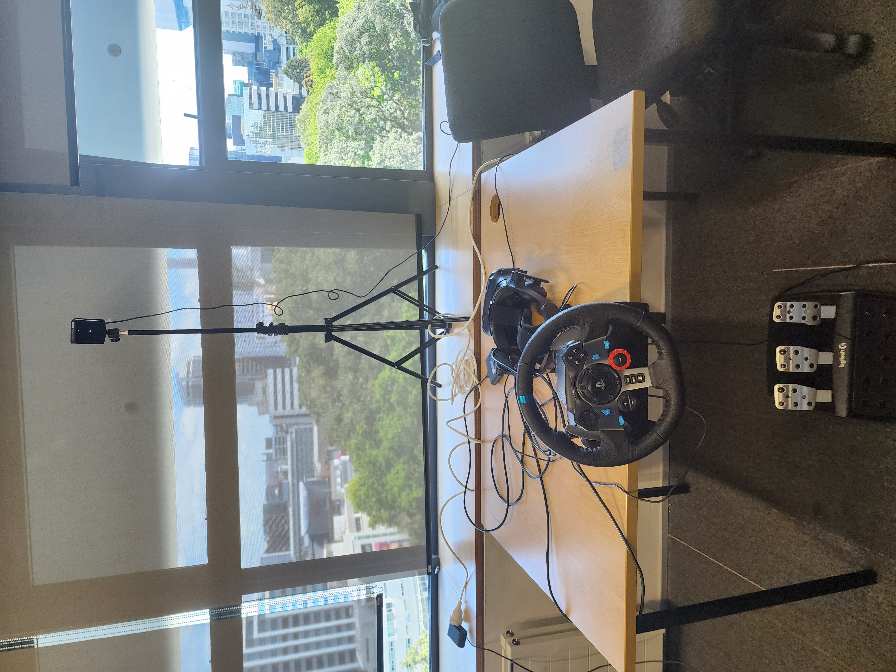

# CS705 Group Project
## VR and Psychophysiological Performance
We try to explore the relationship between humans' psychophysiological data (heart rate, pupil size) and reaction time during the driving simulator.

## Research Outcome

==========等你们多拿几组数据 分析之后再写。 数据分析是 创建一个文件夹，把心率 log_eye, log_Cube, log_Controll都丢进去，然后 ipynb中第一个代码块中的 foldername改一下就可以自动跑。

## README Contents

1. Outcome
2. Experiment Preparation
3. Experiment Tasks
4. Data We Collect
5. Script
6. Static Analysis
7. Future Work

## Experiment Preparation/Installation

Below is the list of software you have to download.
1. Steam and Steam VR
2. Logitech G HUB
3. Unity Hub
4. Polar Flow/Polar Beat
5. Python environment

## Experiment Tasks

Participants will be asked to drive in the VR simulator, and we will generate some random events and obstacles.  

## Data We Collect

We will collect participants' pupil size through the Vive VR headset and their heart rate through the Polar OH1 worn on their arm.   
At the start of the game (when the Start button is clicked), use the Polar Flow app to start recording the heart rate.

## Script

### Greeting

Hello everyone, in this experiment you will wear the VR headset and play a driving game on the driving simulator. We will collect your heart rate through the Polar sensor and you Pupil size through the VR headset. During the experiment, you will need to dodge the obstacles as much as you can. If you feel dizzy, please tell us and stop the experiment.  

### Informed Consent

We will print an informed consent form (can be found in the package), and if the participant accepts the document and signs it, then we will collect the data from them.

### Exact Task

Participants need to drive the car along an infinite straight road, where random obstacles will be generated. Participants must use the steering wheel and pedals to dodge these obstacles. Events such as driving outside the lines (hitting the air walls on either side of the line), driving onto the opposite lane, or hitting obstacles will be detected, resulting in a loss of total marks for the experiment.

## Static Analysis

Download the `requirements.txt` for the Python packages.  
Download the heart rate data from:  
[Polar Flow Diary](https://flow.polar.com/diary/training-list)  
The pupil size and reaction time data are stored in the game log file, generated by each Unity program.  
Create a folder, put heart rate.csv, log_Control*.json, log_CubeLog*.json, log_eye*json, into that file. Change the `data_folder_name = 'exp0_testing'` to the folder you create. And run all to see the result.  
In the `data_processing.ipynb` file, change the file name to the datasets you want to analyze (experiment log and heart rate data). The program will perform a linear regression based on X (reaction time) and Y (heart rate or pupil size).  
The first block of Python code will draw the heart rate graph.  
The second block of code will calculate the heart rate variability, based on the event time and an interval used to calculate the HRV (due to the delay of the sensor, we could try different intervals on the same dataset and check the difference).  
The last block draws the scatter plot of HRV vs. Reaction Time and Pupil Size vs. Reaction Time. It uses the Pearson function to check the linear relationship and the Spearman function to check the nonlinear relationship between those two datasets.

## Future work

Even though our experiment successfully measured the metric we planned to measure, the problem is that it's really hard to determine when the user exactly reacted to the event. In the analysis code, the code detects whether the participant pushed the brake pedal, and if the user turned the steering wheel to a large degree, we consider that they reacted, and we get the minimum reaction time from those two measurements.
So the measured reaction time really varies based on the driving habits of different drivers. If we have enough time to keep working on the project, we could improve the measurement method, gather more data sets, and try to build a more accurate model.
